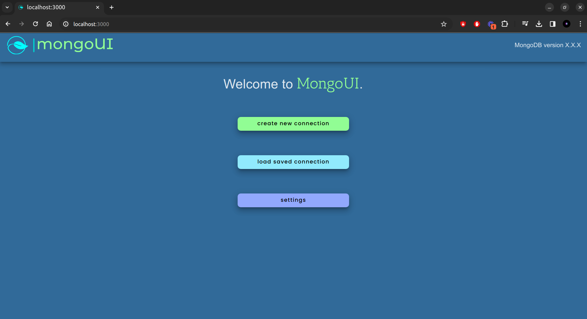

# 

User interface for MongoDB.



## Usage

### Requirements

- Basic knowledge in [MongoDB](https://www.mongodb.com/docs/manual/tutorial/getting-started/)
- An instance of MongoDB.
- Docker if you intend on running the app in a container.
- Node v20.7.0 and above.

Clone this [repository](https://github.com/bryokim/mongoUI).

```Bash
git clone https://github.com/bryokim/mongoUI.git
```

### Setting up without Docker

Make sure to install the dependencies:

```Bash
# npm
npm install

# pnpm
pnpm install

# yarn
yarn install

# bun
bun install
```

Build the application:

```Bash
# npm
npm run build

# pnpm
pnpm run build

# yarn
yarn build

# bun
bun run build
```

Run the application:

```Bash
node ./output/server/index.js
```

> If you change the port use the one you set.

The app can now be accessed on <http://localhost:3000>

### Setting up with Docker

The docker container exposes port 3000 that is mapped to the machine's port 3000.
You can change the port mappings in [Dockerfile](./Dockerfile) and [docker-compose.yml](./docker-compose.yml).

Build and start the container:

```Bash
docker compose up --build
```

If you stop the container, you can restart it using the command below:

```Bash
docker start mongo_ui  # Use name of the image.
```

> If you change the port use the one you set.

The app can now be accessed on <http://localhost:3000>

>To connect to your locally hosted MongoDB, use `host.docker.internal` as your
>host in the connection uri when running the app in a container.

## Contributing

Any contribution is welcome.

## License

`mongoUI` is licensed under the [MIT](./LICENSE) license.

:art:
